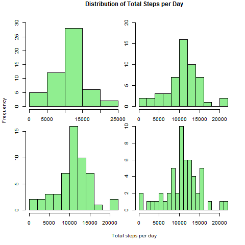
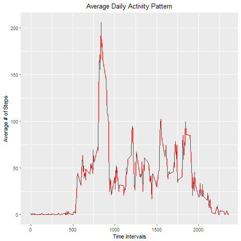
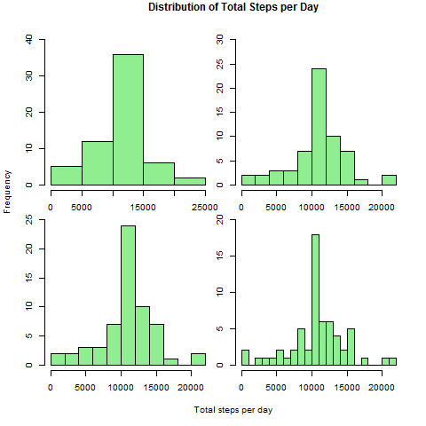
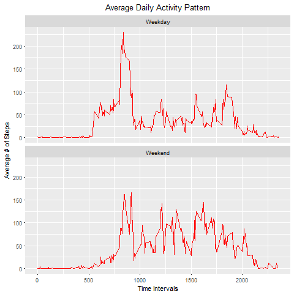

Course Project 1
================

Reproducible Research by Johns Hopkins University
-------------------------------------------------

### Introduction

It is now possible to collect a large amount of data about personal
movement using activity monitoring devices such as a Fitbit, Nike
Fuelband, or Jawbone Up. However, these data remain under-utilized both
because the raw data are hard to obtain and there is a lack of
statistical methods and software for processing and interpreting the
data.

### Data

This course project makes use of data from a personal activity
monitoring device. This device collects data at 5 minute intervals
through out the day. The data consists of two months of data from an
anonymous individual collected during the months of October and
November, 2012 and include the number of steps taken in 5 minute
intervals each day.

The variables included in this dataset are:

-   steps: Number of steps taking in a 5-minute interval (missing values
    are coded as NA)
-   date: The date on which the measurement was taken in YYYY-MM-DD
    format
-   interval: Identifier for the 5-minute interval in which measurement
    was taken

The dataset is stored in a comma-separated-value file and there are a
total of 17,568 observations in this dataset. The dataset can be
downloaded from the course web site.

### Loading and preprocessing the data

Let's first load the data into R.

    data <- read.csv("activity.csv")

Rather than using the date variable as factor type, we create a new Date
variable as a new column in the data frame.

    data$Date <- as.Date(data$date, "%Y-%m-%d")

In addition, we create a new data frame called 'sub\_data' in which the
observations that have missing steps values are eliminated.

    sub_data <- data[!is.na(data[,1]),]

### What is mean total number of steps taken per day?

For this part let's first find the total number of steps taken per day.

    total.steps.per.day <- with(sub_data, aggregate(steps, by = list(Date), sum))
    names(total.steps.per.day) <- c("Date", "Total.Steps")

Now we plot the histogram to see the distribution and frequency of the
total number of steps per day. In histograms, number of bin sizes or
breaks are important because they provide different levels of detail
about data distribution. Here in order to show you different levels of
distribution, we plot 4 histograms using different breaks (5, 10, 15 and
20).

    op <- par(mfrow = c(2,2), oma = c(5,4,1,0) + 0.1, mar = c(0,0,2,2) + 0.1)

    hist(total.steps.per.day$Total.Steps, xlab = "", main = "", col = "lightgreen", ylim = c(0,30))
    hist(total.steps.per.day$Total.Steps, xlab = "", main = "", col = "lightgreen", breaks = 10, ylim = c(0,20))
    hist(total.steps.per.day$Total.Steps, xlab = "", main = "", col = "lightgreen", breaks = 15)
    hist(total.steps.per.day$Total.Steps, xlab = "", main = "", col = "lightgreen", breaks = 20)

    title("Distribution of Total Steps per Day", outer=TRUE)
    title(xlab = "Total steps per day", ylab = "Frequency", outer = TRUE)

Furthermore, you can see the mean and median of the total number of
steps taken per day below.

    mean(total.steps.per.day$Total.Steps)

    ## [1] 10766.19

    median(total.steps.per.day$Total.Steps)

    ## [1] 10765

### What is the average daily activity pattern?

In order to understand average daily activity pattern, we need to first
calculate the average number of steps for each interval. That will give
us an idea about daily activity pattern.

    average.steps.per.interval <- with(sub_data, aggregate(steps, by = list(interval), mean))
    names(average.steps.per.interval) <- c("Interval", "Average.Steps")

In order to observe the average daily activity pattern of the
individual, we plot a time series plot of the 5-minute interval and the
average number of steps taken, averaged across all days. We load the
ggplot2 to R and plot the below figure.

    library("ggplot2")

    time_series_plot <- ggplot(data = average.steps.per.interval, aes(x = Interval, y = Average.Steps)) + geom_line(colour = "red") + ggtitle("Average Daily Activity Pattern") + theme(plot.title = element_text(hjust = 0.5)) + ylab("Average # of Steps") + xlab("Time Intervals")
    time_series_plot

In the above plot, we observe the maximum number of steps around 8 am.
Let's find the exact interval.

    average.steps.per.interval$Interval[which.max(average.steps.per.interval$Average.Steps)]

    ## [1] 835

So the maximum number of steps observed between 8.35-8.40 am.

### Imputing missing values

We know that in the given dataset, step values are missing for some
dates and intervals. In order to handle this problem, let's first find
the total number of missing values in the dataset..

    sum(is.na(data$steps))

    ## [1] 2304

As indicated in the project, the presence of missing number of steps in
days/intervals may introduce bias into some calculations or summaries of
the data. In order to overcome this issue, we can replace the missing
values with the mean for that 5-minute interval.

Below we create a new dataset called 'data\_v2' in which the missing
observations are filled in with the mean number of steps observed during
that 5-minute interval.

    data.v2 = data

    for(i in 1:length(data.v2$steps)) { 
      if(is.na(data.v2$steps[i])) {
        data.v2$steps[i] = average.steps.per.interval$Average.Steps[which(average.steps.per.interval$Interval %in% data.v2$interval[i])]
      }
    }

So, using this modified data we recalculate total number of steps taken
per day, and compare the mean and median total number of steps taken per
day between these two data sets.

    total.steps.per.day.v2 <- with(data.v2, aggregate(steps, by = list(Date), sum))
    names(total.steps.per.day.v2) <- c("Date", "Total.Steps")

First we plot the histogram to see the distribution and frequency of the
newly recalculated total number of steps per day.

    op <- par(mfrow = c(2,2), oma = c(5,4,1,0) + 0.1, mar = c(0,0,2,2) + 0.1)

    hist(total.steps.per.day.v2$Total.Steps, xlab = "", main = "", col = "lightgreen", ylim = c(0,40))
    hist(total.steps.per.day.v2$Total.Steps, xlab = "", main = "", col = "lightgreen", breaks = 10, ylim = c(0,30))
    hist(total.steps.per.day.v2$Total.Steps, xlab = "", main = "", col = "lightgreen", breaks = 15, ylim = c(0,25))
    hist(total.steps.per.day.v2$Total.Steps, xlab = "", main = "", col = "lightgreen", breaks = 20, ylim = c(0,20))

    title("Distribution of Total Steps per Day", outer=TRUE)
    title(xlab = "Total steps per day", ylab = "Frequency", outer = TRUE)

And now recalculate the mean and median

    mean(total.steps.per.day.v2$Total.Steps)

    ## [1] 10766.19

    median(total.steps.per.day.v2$Total.Steps)

    ## [1] 10766.19

As you can see from the results, the mean values are exactly same in
both data sets. Furthermore, when we compare the median values, we see
that the median in the second data set is closer to (actually exactly
same with) the mean value.

### Are there differences in activity patterns between weekdays and weekends?

For this part of the project we first create a new variable in the
dataset with two levels - "weekday" and "weekend" indicating whether a
given date is a weekday or weekend day.

    data.v2$Day <- ifelse(weekdays(data.v2$Date) %in% c("Saturday", "Sunday"), "Weekend", "Weekday")

In order to understand average daily activity pattern differences
between weekdays and weekends, we first need to aggregate number of
steps for each interval and two "Day" levels.

    average.steps.per.interval.v2 <- with(data.v2, aggregate(steps, by = list(interval, Day), mean))
    names(average.steps.per.interval.v2) <- c("Interval", "Day", "Average.Steps")

Then we make a panel plot containing a time series plot of the 5-minute
interval and the average number of steps taken, averaged across all
weekday days or weekend days.

    time_series_plot.v2 <- ggplot(data = average.steps.per.interval.v2, aes(x = Interval, y = Average.Steps)) + geom_line(colour = "red") + facet_wrap(~Day, nrow = 2) + ggtitle("Average Daily Activity Pattern") + theme(plot.title = element_text(hjust = 0.5)) + ylab("Average # of Steps") + xlab("Time Intervals")
    time_series_plot.v2

As you can see from the above time series plots, there are slight
differences between the daily activity pattern between weekdays and
weekends. For instance, during weekdays individual's daily activity
starts earlier than weekend, and ends earlier in the evenings.
Furthermore, even though we observe a higher peak during weekdays around
8.35 am, we observe more daily activity during weekends. Considering
people's weekday and weekend routines these differences are expected.
