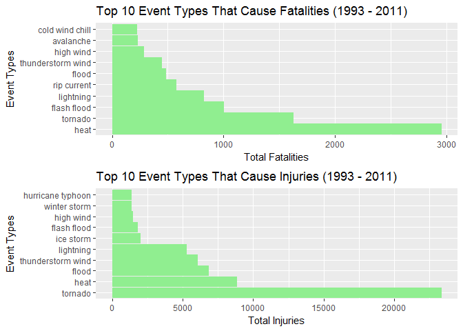
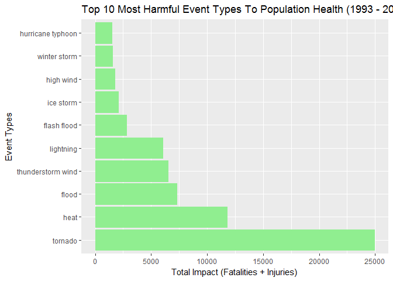
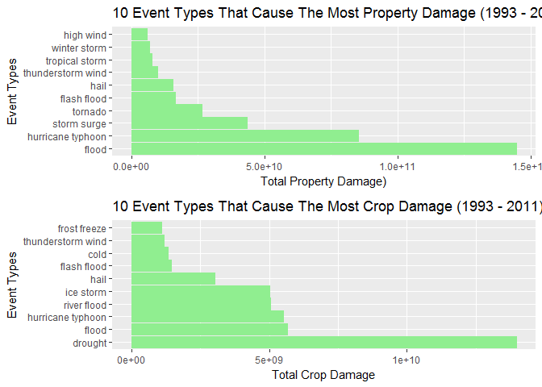
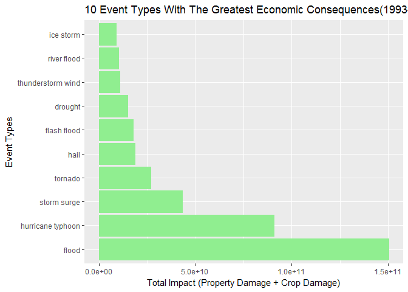

Course Project 2
================

Reproducible Research by Johns Hopkins University
-------------------------------------------------

### Introduction

Storms and other severe weather events can cause both public health and
economic problems for communities and municipalities. Many severe events
can result in fatalities, injuries, and property damage, and preventing
such outcomes to the extent possible is a key concern.

This project involves exploring the U.S. National Oceanic and
Atmospheric Administration's (NOAA) storm database. This database tracks
characteristics of major storms and weather events in the United States,
including when and where they occur, as well as estimates of any
fatalities, injuries, and property damage. The basic goal of this
project is to explore the NOAA Storm Database and answer some basic
questions about severe weather events.

### Data

The data for this project come in the form of a comma-separated-value
file compressed via the bzip2 algorithm to reduce its size. You can
download the file from the course web site.

There is also some documentation of the database. In the below files you
can find how some of the variables are constructed/defined. Information
we obtain from the below files will become useful in the data processing
and analysis steps.

-   National Weather Service Storm Data Documentation
-   National Climatic Data Center Storm Events FAQ

Let's first load the data and become familiar with the available
variables:

    data <- read.csv(bzfile("repdata-data-StormData.csv.bz2"))
    str(data)

    ## 'data.frame':    902297 obs. of  37 variables:
    ##  $ STATE__   : num  1 1 1 1 1 1 1 1 1 1 ...
    ##  $ BGN_DATE  : Factor w/ 16335 levels "1/1/1966 0:00:00",..: 6523 6523 4242 11116 2224 2224 2260 383 3980 3980 ...
    ##  $ BGN_TIME  : Factor w/ 3608 levels "00:00:00 AM",..: 272 287 2705 1683 2584 3186 242 1683 3186 3186 ...
    ##  $ TIME_ZONE : Factor w/ 22 levels "ADT","AKS","AST",..: 7 7 7 7 7 7 7 7 7 7 ...
    ##  $ COUNTY    : num  97 3 57 89 43 77 9 123 125 57 ...
    ##  $ COUNTYNAME: Factor w/ 29601 levels "","5NM E OF MACKINAC BRIDGE TO PRESQUE ISLE LT MI",..: 13513 1873 4598 10592 4372 10094 1973 23873 24418 4598 ...
    ##  $ STATE     : Factor w/ 72 levels "AK","AL","AM",..: 2 2 2 2 2 2 2 2 2 2 ...
    ##  $ EVTYPE    : Factor w/ 985 levels "   HIGH SURF ADVISORY",..: 834 834 834 834 834 834 834 834 834 834 ...
    ##  $ BGN_RANGE : num  0 0 0 0 0 0 0 0 0 0 ...
    ##  $ BGN_AZI   : Factor w/ 35 levels "","  N"," NW",..: 1 1 1 1 1 1 1 1 1 1 ...
    ##  $ BGN_LOCATI: Factor w/ 54429 levels "","- 1 N Albion",..: 1 1 1 1 1 1 1 1 1 1 ...
    ##  $ END_DATE  : Factor w/ 6663 levels "","1/1/1993 0:00:00",..: 1 1 1 1 1 1 1 1 1 1 ...
    ##  $ END_TIME  : Factor w/ 3647 levels ""," 0900CST",..: 1 1 1 1 1 1 1 1 1 1 ...
    ##  $ COUNTY_END: num  0 0 0 0 0 0 0 0 0 0 ...
    ##  $ COUNTYENDN: logi  NA NA NA NA NA NA ...
    ##  $ END_RANGE : num  0 0 0 0 0 0 0 0 0 0 ...
    ##  $ END_AZI   : Factor w/ 24 levels "","E","ENE","ESE",..: 1 1 1 1 1 1 1 1 1 1 ...
    ##  $ END_LOCATI: Factor w/ 34506 levels "","- .5 NNW",..: 1 1 1 1 1 1 1 1 1 1 ...
    ##  $ LENGTH    : num  14 2 0.1 0 0 1.5 1.5 0 3.3 2.3 ...
    ##  $ WIDTH     : num  100 150 123 100 150 177 33 33 100 100 ...
    ##  $ F         : int  3 2 2 2 2 2 2 1 3 3 ...
    ##  $ MAG       : num  0 0 0 0 0 0 0 0 0 0 ...
    ##  $ FATALITIES: num  0 0 0 0 0 0 0 0 1 0 ...
    ##  $ INJURIES  : num  15 0 2 2 2 6 1 0 14 0 ...
    ##  $ PROPDMG   : num  25 2.5 25 2.5 2.5 2.5 2.5 2.5 25 25 ...
    ##  $ PROPDMGEXP: Factor w/ 19 levels "","-","?","+",..: 17 17 17 17 17 17 17 17 17 17 ...
    ##  $ CROPDMG   : num  0 0 0 0 0 0 0 0 0 0 ...
    ##  $ CROPDMGEXP: Factor w/ 9 levels "","?","0","2",..: 1 1 1 1 1 1 1 1 1 1 ...
    ##  $ WFO       : Factor w/ 542 levels ""," CI","$AC",..: 1 1 1 1 1 1 1 1 1 1 ...
    ##  $ STATEOFFIC: Factor w/ 250 levels "","ALABAMA, Central",..: 1 1 1 1 1 1 1 1 1 1 ...
    ##  $ ZONENAMES : Factor w/ 25112 levels "","                                                                                                                               "| __truncated__,..: 1 1 1 1 1 1 1 1 1 1 ...
    ##  $ LATITUDE  : num  3040 3042 3340 3458 3412 ...
    ##  $ LONGITUDE : num  8812 8755 8742 8626 8642 ...
    ##  $ LATITUDE_E: num  3051 0 0 0 0 ...
    ##  $ LONGITUDE_: num  8806 0 0 0 0 ...
    ##  $ REMARKS   : Factor w/ 436781 levels "","-2 at Deer Park\n",..: 1 1 1 1 1 1 1 1 1 1 ...
    ##  $ REFNUM    : num  1 2 3 4 5 6 7 8 9 10 ...

As you can see we have a large data set with 902,297 observations and 37
variables. Before starting our analysis, we need to process the data and
make it more suitable for our analysis.

### Data processing

Since the data set is very large, we will try to eliminate unnecessary
observations and variables.

#### Eliminating unnecessary variables

First of all, we create a subset of the data set by taking only the
required variables for the analysis. For our analysis we will keep only
the following variables:

-   BGN\_DATE
-   EVTYPE
-   FATALITIES
-   INJURIES
-   PROPDMG
-   PROPDMGEXP
-   CROPDMG
-   CROPDMGEXP

<!-- -->

    temp.data.1 <- subset(data, select = c("BGN_DATE", "EVTYPE","FATALITIES", "INJURIES", "PROPDMG", "PROPDMGEXP", "CROPDMG", "CROPDMGEXP"))

#### Eliminating the observations recorded in earlier years

The events in the data set start in the year 1950 and end in November
2011. However, the project document states that in the earlier years
fewer event types were recorded to the database. In order to solve this
issue let's first find the number of unique event types recorded each
year.

First, we convert the factor type BGN\_DATE variable into a Date type.
Then we create a new YEAR variable. Using the EVTYPE and YEAR variables,
we can find the unique number of event types observed at each year.

    temp.data.1$BGN_DATE <- as.Date(temp.data.1$BGN_DATE, format = "%m/%d/%Y")
    temp.data.1$YEAR <- format(temp.data.1$BGN_DATE,"%Y")
    date.data <- unique(temp.data.1[,c("EVTYPE", "YEAR")])
    table(date.data[,2])

    ## 
    ## 1950 1951 1952 1953 1954 1955 1956 1957 1958 1959 1960 1961 1962 1963 1964 
    ##    1    1    1    1    1    3    3    3    3    3    3    3    3    3    3 
    ## 1965 1966 1967 1968 1969 1970 1971 1972 1973 1974 1975 1976 1977 1978 1979 
    ##    3    3    3    3    3    3    3    3    3    3    3    3    3    3    3 
    ## 1980 1981 1982 1983 1984 1985 1986 1987 1988 1989 1990 1991 1992 1993 1994 
    ##    3    3    3    3    3    3    3    3    3    3    3    3    3  160  267 
    ## 1995 1996 1997 1998 1999 2000 2001 2002 2003 2004 2005 2006 2007 2008 2009 
    ##  387  228  170  126  121  112  122   99   51   38   46   50   46   46   46 
    ## 2010 2011 
    ##   46   46

From the above table we can see that the number of different EVTYPE were
really very small in the earlier years. Up until 1993, only three types
of events (HAIL, TORNADO, and TSTM WIND) were stored in the data set. In
order to prevent a bias towards these three event types, we use only the
observations observed after 1992.

    temp.data.2 <- subset(temp.data.1, temp.data.1$BGN_DATE > as.Date("1992-12-31"))

#### Processing EVTYPE

According to the Storm Data Event Table (Table 1, p.6) in the NWS Storm
Data Documentation, there should be 48 event types in the data set.
However, in the previous part we see that for instance in 1995, 387
different EVTYPE were recorded. A brief scan of the EVTYPE variable
shows us that there are some misspellings or minor variances in the
entries that should be handled before starting the analysis.

    length(unique(temp.data.2$EVTYPE))

    ## [1] 985

    events <- temp.data.2$EVTYPE

At the beginning, there are 985 different EVTYPE in the dataset. After
each step we will check the number of unique EVTYPE and observe our
progress.

##### Convert to lower case letters:

Let's first convert all letters in the EVTYPE to lower case so that
variations such as "Thunderstorm Wind" and "THUNDERSTORM WIND" can be
counted together.

    events <- tolower(events)
    length(unique(events))

    ## [1] 898

##### Remove all punctuation marks:

Now we remove all punctuation marks from the EVTYPE entries. Therefore,
EVTYPEs such as "frost/freeze" and "frost\\freeze" can match.

    events <- gsub("[[:punct:]+]", " ", events)
    length(unique(events))

    ## [1] 874

##### Remove trailing numbers, letters or conjunctions:

In the EVTYPE, we observe some entries have extra numbers or letters
such as "high wind 48", "hail 1 75", "thunderstorm wind g50", and
"tornado f0". At this step, we handle these cases so that they can match
to the given 48 storm event types. During this step we also observe some
entries like "thunderstorm wind 59 mph" and we handle them. In addition,
some of the EVTYPEs have conjunctions at the end, such as "heavy snow
and" and "thunderstorm winds and". So, we remove such conjunctions from
the entries.

    events <- gsub(" [a-z]\\d+\\s*$", "", events)
    events <- gsub("\\d* \\d+\\s*$", "", events)
    events <- gsub(" \\d+\\s*mph\\s*$", "", events)
    events <- gsub(" and$", "", events)
    length(unique(events))

    ## [1] 750

##### Trim leading and trailing whitespaces, replace multiple space with single space:

Some observations have spaces at the beginning or ending of the EVTYPE.
Thus, we trim all the leading and trailing whitespaces. Also, some
entries have multiple spaces in between words. So, we replace such cases
with single space.

    events <- gsub("^\\s+|\\s+$", "", events)
    events <- gsub("\\s{2,}", "\\s", events)
    length(unique(events))

    ## [1] 726

##### Convert plural to singular:

We remove the trailing "s" characters so that plural words can match
with the singular ones such as "rip currents" and "rip current".

    events <- gsub("s$", "", events)
    length(unique(events))

    ## [1] 681

##### Handle more specific cases:

In the given storm event type list we have "Hurricane (Typhoon)";
however, in the data we observe more specific cases such as "hurricane
erin" and "hurricane opal". We handle such cases below.

    events <- gsub("^hurricane .*$", "hurricane typhoon", events)
    events <- gsub("^hurricane$", "hurricane typhoon", events)
    events <- gsub("^typhoon$", "hurricane typhoon", events)
    length(unique(events))

    ## [1] 671

Furthermore, in the EVTYPE data, we observe some entries like "summary
of april" or "summary of may 26 am". Since these entries have no match
in the 48 event types, we just replace them with empty strings.

    events <- gsub("^summary.*$", "", events)
    length(unique(events))

    ## [1] 648

In the storm event list we have "Coastal Flood", "Flash Flood", and
"Flood" types; however, in the given data we have EVTYPEs such as
"coastal flooding", "flash flooding", and "flooding". So at this step we
handle such cases.

    events <- gsub("flooding", "flood", events)
    length(unique(events))

    ## [1] 636

Moreover, in the EVTYPE we observe that some of the entries have
adjectives or adverbs that emphasize the level or impact of the event.
Here is a few example: "record excessive heat", "severe thunderstorm
wind", "unseasonably cold", "unusual warmth", and "very dry". Even
though these events were stored this way, during the analysis they
should be grouped together with the same event types. Therefore, at this
step we remove these adverbs from the EVTYPE data. Below is a list of
removed words:

-   record
-   very
-   extreme
-   excessive
-   severe
-   unusual
-   unusually
-   unseasonal
-   unseasonably

<!-- -->

    events <- gsub("record|very|extreme|excessive|severe|unusual|unusually|unseasonal|unseasonably", "", events)
    events <- gsub("^\\s+|\\s+$", "", events)
    events <- gsub("\\s{2,}", "\\s", events)
    events <- gsub("s$", "", events)
    length(unique(events))

    ## [1] 593

Finally, in the data we observe two event types a lot but in fact they
are not in our list of 48 storm event types. These are "tstm wind"
(129058 times) and "marine tstm wind" (6175 times). These two events are
same as "thunderstorm wind" and "marine thunderstorm wind"
respectivelly. Thus, at this step we replace "tstm" with "thunderstorm".

    events <- gsub("tstm", "thunderstorm", events)
    length(unique(events))

    ## [1] 588

##### Spelling correction:

After all the above modifications when we check the data, we observe
some misspellings such as:

-   Extra character: "wayterspout" (should have been "waterspout")
-   Extra space: "thunderstorm w ind" (should have been
    "thunderstorm wind")
-   Missing character: "thunderstorm win" (should have been
    "thunderstorm wind")
-   Misplaced characters: "tornadoe" and "torndao" (should have
    been "tornado")

Therefore, as the last step in the data processing, we perform spelling
correction on the data. Using the **"correct"** function from [Peter
Norvig's Spell Checker in Two Lines of Base
R](http://www.sumsar.net/blog/2014/12/peter-norvigs-spell-checker-in-two-lines-of-r/)
we try to correct some of the misspelled event types.

During this step, rather than using an available dictionary, we use the
100 most frequently observed events from our processed data as our
reference for correcting misspelled words. For this process, the
reference words are very important because for each misspelled word the
edit distance will be calculated using these reference words.

    #sort(table(events),decreasing=TRUE)[1:100]
    sorted_words <- names(sort(table(events),decreasing=TRUE)[1:100])

    correct <- function(word) { c(sorted_words[ adist(word, sorted_words) <= min(adist(word, sorted_words), 2)], word)[1] }

    temp.data.2$EVTYPE2 <- sapply(events, correct)
    length(unique(temp.data.2$EVTYPE2))

    ## [1] 541

Finally, as you can see we reduce the unique event types number from 985
to 541.

### Most harmful events with respect to population health

Now, we can start our analysis. In this part of the analysis, we need to
find types of events that are most harmful with respect to population
health. For this analysis we create a new data frame that contains only
the variables we will use in this part.

In the given NWS Storm Data Documentation, fatalities and injuries
directly caused by the weather event is entered in the Storm Database as
"fatality" and "injury" entry fields. In order to determine events that
are most harmful to population health, we will use these two entry
fields.

    population.health <- subset(temp.data.2, select = c("EVTYPE2", "FATALITIES", "INJURIES"))

    fatalities <- aggregate(population.health$FATALITIES, by=list((population.health$EVTYPE2)),sum)
    colnames(fatalities) = c("Event.Type", "Total.Fatalities")

    injuries <- aggregate(population.health$INJURIES, by=list((population.health$EVTYPE2)),sum)
    colnames(injuries) = c("Event.Type", "Total.Injuries")

    top.fatalities <- fatalities[order(-fatalities$Total.Fatalities),][1:10,]
    top.injuries <- injuries[order(-injuries$Total.Injuries),][1:10,]

Now let's take a look at the top 10 event types that cause fatalities,
and the top 10 event types that cause injuries:

    fatalities.plot <-ggplot(data = top.fatalities, aes(x = reorder(Event.Type, -Total.Fatalities), y =  Total.Fatalities)) + geom_bar(stat = "identity", fill="light green", colour="light green") + coord_flip() + labs(title = "Top 10 Event Types That Cause Fatalities (1993 - 2011)", x = "Event Types", y = "Total Fatalities")
     
    injuries.plot <-ggplot(data = top.injuries, aes(x = reorder(Event.Type, -Total.Injuries), y =  Total.Injuries)) + geom_bar(stat = "identity", fill="light green", colour="light green") + coord_flip() + labs(title = "Top 10 Event Types That Cause Injuries (1993 - 2011)", x = "Event Types", y = "Total Injuries")
     
    grid.arrange(fatalities.plot, injuries.plot, nrow=2)

As you can see from the above plots, between 1993 and 2011 **"heat"**
caused the most fatalities while **"tornado"** caused the most injuries.

Furthermore, rather than analyzing fatalities and injuries separatelly,
we can analyze the events' total impact to population health. For this
analysis we need to merge "FATALITIES" and "INJURIES" variables. The
most simple way to merge these two variables is to add them. However, at
this step we should also consider the fact that compared to injuries,
fatalities have more serious impact on population health. In order to
solve this problem, we can add these two variable using different
weights so that their effect on the total impact will be different.
Below we try 4 different weight options:

-   Total Impact with Weight 1 = Fatalities + Injuries
-   Total Impact with Weight 3 = **3 \* **Fatalities + Injuries
-   Total Impact with Weight 5 = **5 \* **Fatalities + Injuries
-   Total Impact with Weight 10 = **10 \* **Fatalities + Injuries

<!-- -->

    population.health$TOTAL.IMPACT.W1 <- population.health$FATALITIES + population.health$INJURIES
    population.health$TOTAL.IMPACT.W3 <- population.health$FATALITIES*3 + population.health$INJURIES
    population.health$TOTAL.IMPACT.W5 <- population.health$FATALITIES*5 + population.health$INJURIES
    population.health$TOTAL.IMPACT.W10 <- population.health$FATALITIES*10 + population.health$INJURIES

    total.impact.w1 <- aggregate(population.health$TOTAL.IMPACT.W1, by=list((population.health$EVTYPE2)),sum)
    colnames(total.impact.w1) = c("Event.Type", "Total.Impact")

    total.impact.w3 <- aggregate(population.health$TOTAL.IMPACT.W3, by=list((population.health$EVTYPE2)),sum)
    colnames(total.impact.w3) = c("Event.Type", "Total.Impact")

    total.impact.w5 <- aggregate(population.health$TOTAL.IMPACT.W5, by=list((population.health$EVTYPE2)),sum)
    colnames(total.impact.w5) = c("Event.Type", "Total.Impact")

    total.impact.w10 <- aggregate(population.health$TOTAL.IMPACT.W10, by=list((population.health$EVTYPE2)),sum)
    colnames(total.impact.w10) = c("Event.Type", "Total.Impact")

    top.w1 <- total.impact.w1[order(-total.impact.w1$Total.Impact),][1:10,]
    top.w3 <- total.impact.w3[order(-total.impact.w3$Total.Impact),][1:10,]
    top.w5 <- total.impact.w5[order(-total.impact.w5$Total.Impact),][1:10,]
    top.w10 <- total.impact.w10[order(-total.impact.w10$Total.Impact),][1:10,]

Now, let's take a look at the top events obtained using same weights for
fatalities and injuries:

    population.health.plot <-ggplot(data = top.w1, aes(x = reorder(Event.Type, -Total.Impact), y =  Total.Impact)) + 
      geom_bar(stat = "identity", fill="light green", colour="light green") + 
      coord_flip() + 
      labs(title = "Top 10 Most Harmful Event Types To Population Health (1993 - 2011)", x = "Event Types", y = "Total Impact (Fatalities + Injuries)")
    population.health.plot 

When we look at the total impact, as expected **"tornado"** and
**"heat"** are again the most harmful event types to population health.
This is also the case when we use different weight options for total
impact (please see the below table for top 10 harmful events based on
different weights).

    tops = data.frame(top.w1$Event.Type, top.w3$Event.Type, top.w5$Event.Type, top.w10$Event.Type)
    tops

    ##    top.w1.Event.Type top.w3.Event.Type top.w5.Event.Type
    ## 1            tornado           tornado           tornado
    ## 2               heat              heat              heat
    ## 3              flood             flood         lightning
    ## 4  thunderstorm wind         lightning             flood
    ## 5          lightning thunderstorm wind thunderstorm wind
    ## 6        flash flood       flash flood       flash flood
    ## 7          ice storm         high wind       rip current
    ## 8          high wind       rip current         high wind
    ## 9       winter storm         ice storm         ice storm
    ## 10 hurricane typhoon      winter storm      winter storm
    ##    top.w10.Event.Type
    ## 1             tornado
    ## 2                heat
    ## 3           lightning
    ## 4         flash flood
    ## 5               flood
    ## 6   thunderstorm wind
    ## 7         rip current
    ## 8           high wind
    ## 9        winter storm
    ## 10          ice storm

### Events that have the greatest economic consequences

In the second part of the analysis, we need to find types of events that
have the greatest economic consequences. In the given data, the property
damage and crop damage are represented with two fields each,
PROPDMG/CROPDMG keep the estimated dolar amount rounded to three
significant digits and PROPDMGEXP/CROPDMGEXP keep the alphabetical
character signifying the magnitude of the number such as "K" for
thousands, "M" for millions, and "B" for billions. Again for this
analysis we create a new data frame that contains only the variables we
will use in this part.

In the data set, a lot of zeros were observed in PROPDMG and CROPDMG
variables. Since those observations will have no impact to our analysis,
we keep only the observations that have positive values for either one
of these two variables.

    economic.consequences <- temp.data.2 %>% 
        select(EVTYPE2, PROPDMG, PROPDMGEXP, CROPDMG, CROPDMGEXP) %>%
        filter(PROPDMG > 0 | CROPDMG > 0)

Now let's take a look at the PROPDMGEXP and CROPDMGEXP variables. As you
can see from the below tables, other than "K", "M" or "B" factors, there
exist some other factors. However, we could not find any explanation for
these factors in the NWS Storm Data Documentation. Since we do not have
any information about these factors and their frequency is very low
(0.1% in PROPDMGEXP and 0.06% in CROPDMGEXP) we decide to use only the
PROPDMG and CROPDMG values for these observations.

    print(table(economic.consequences[economic.consequences$PROPDMG >0,]$PROPDMGEXP))

    ## 
    ##             -      ?      +      0      1      2      3      4      5 
    ##     76      1      0      5    209      0      1      1      4     18 
    ##      6      7      8      B      h      H      K      m      M 
    ##      3      2      0     40      1      6 204602      7   8546

    print(table(economic.consequences[economic.consequences$CROPDMG >0,]$CROPDMGEXP))

    ## 
    ##           ?     0     2     B     k     K     m     M 
    ##     3     0    12     0     7    21 20137     1  1918

At this step, we create a new variable that has the estimated damage
amount calculated using PROPDMG and PROPDMGEXP (and CROPDMG and
CROPDMGEXP):

    economic.consequences$PROPDMGEXP2 <- 1
    economic.consequences$PROPDMGEXP2[economic.consequences$PROPDMGEXP == "K" | economic.consequences$PROPDMGEXP == "k"] <- 10^3
    economic.consequences$PROPDMGEXP2[economic.consequences$PROPDMGEXP == "M" | economic.consequences$PROPDMGEXP == "m"] <- 10^6
    economic.consequences$PROPDMGEXP2[economic.consequences$PROPDMGEXP == "B"] <- 10^9

    economic.consequences$PROPDMG2 <- economic.consequences$PROPDMG * economic.consequences$PROPDMGEXP2

    economic.consequences$CROPDMGEXP2 <- 1
    economic.consequences$CROPDMGEXP2[economic.consequences$CROPDMGEXP == "K" | economic.consequences$CROPDMGEXP == "k"] <- 10^3
    economic.consequences$CROPDMGEXP2[economic.consequences$CROPDMGEXP == "M" | economic.consequences$CROPDMGEXP == "m"] <- 10^6
    economic.consequences$CROPDMGEXP2[economic.consequences$CROPDMGEXP == "B"] <- 10^9

    economic.consequences$CROPDMG2 <- economic.consequences$CROPDMG * economic.consequences$CROPDMGEXP2

Using the newly created variables, we can aggregate the total property
and total crop damage for each event type, and find the top 10 events
that caused the greatest damage:

    property.damage <- aggregate(economic.consequences$PROPDMG2, by=list((economic.consequences$EVTYPE2)),sum)
    colnames(property.damage) = c("Event.Type", "Total.Property.Damage")

    crop.damage <- aggregate(economic.consequences$CROPDMG2, by=list((economic.consequences$EVTYPE2)),sum)
    colnames(crop.damage) = c("Event.Type", "Total.Crop.Damage")

    top.property.damage <- property.damage[order(-property.damage$Total.Property.Damage),][1:10,]
    top.crop.damage <- crop.damage[order(-crop.damage$Total.Crop.Damage),][1:10,]

    property.damage.plot <-ggplot(data = top.property.damage, aes(x = reorder(Event.Type, -Total.Property.Damage), y =  Total.Property.Damage)) + 
      geom_bar(stat = "identity", fill="light green", colour="light green") + 
      coord_flip() + 
      labs(title = "10 Event Types That Cause The Most Property Damage (1993 - 2011)", x = "Event Types", y = "Total Property Damage)")
     
    crop.damage.plot <-ggplot(data = top.crop.damage, aes(x = reorder(Event.Type, -Total.Crop.Damage), y =  Total.Crop.Damage)) + 
      geom_bar(stat = "identity", fill="light green", colour="light green") + 
      coord_flip() + 
      labs(title = "10 Event Types That Cause The Most Crop Damage (1993 - 2011)", x = "Event Types", y = "Total Crop Damage")
     
    grid.arrange(property.damage.plot, crop.damage.plot, nrow=2)

As you can see from the above plots, **"flood"** caused the most
property damage while **"drought"** caused the most crop damage.

Similar to the previous part of the analysis, rather than analyzing
property and crop damages separatelly, we can analyze the events' total
economical impacts together. Since property damage and crop damage do
not have different significance levels, we just simply add these two
variables to calculate the total impact:

    economic.consequences$TOTAL.IMPACT <- economic.consequences$PROPDMG2 + economic.consequences$CROPDMG2

    total.impact <- aggregate(economic.consequences$TOTAL.IMPACT, by=list((economic.consequences$EVTYPE2)),sum)
    colnames(total.impact) = c("Event.Type", "Total.Impact")

    top <- total.impact[order(-total.impact$Total.Impact),][1:10,]

    economic.consequences.plot <-ggplot(data = top, aes(x = reorder(Event.Type, -Total.Impact), y =  Total.Impact)) + 
      geom_bar(stat = "identity", fill="light green", colour="light green") + 
      coord_flip() + 
      labs(title = "10 Event Types With The Greatest Economic Consequences(1993-2011)", x = "Event Types", y = "Total Impact (Property Damage + Crop Damage)")
    economic.consequences.plot 

When we look at the total impact, **"flood"** had the greatest economic
consequence between 1993 and 2011.

The above plot indicates that by far **"flood"** cause the most property
and crop damage. Furthermore, in the top 10 most damaging event types,
we have 2 other flood related events: "river flood" and "flash flood". I
think there is a bias in the data which leads to these results. In the
NWS Storm Data Documentation, it is stated that "*Property damage
estimates should be entered as actual dollar amounts, if a reasonably
accurate estimate from an insurance company or other qualified
individual is available. If this estimate is not available, then the
preparer has two choices: either check the "no information available"
box, or make an estimate. The exception is for flood events. The Storm
Data preparer must enter monetary damage amounts for flood events, even
if it is a "guesstimate." The U.S. Army Corps of Engineers requires the
NWS to provide monetary damage amounts (property and/or crop) resulting
from any flood event.*"

Therefore, I believe the reason we observe so much flood related event
types in the top 10 list is this requirement to enter the damage amount
even it is an estimate.

### Conclusion

At the end of the above analysis, we received to the below conclusions:

-   Heat caused the most number of fatalities between 1993 and 2011
    while tornados caused the most injuries. In general, heat, tornado,
    flood, flash flood, lightning, thunderstorm wind, and high wind are
    the top event types that cause fatalities and injuries.

-   When considering the general impact to the population health, we
    observe that tornado is the most harmful event type followed
    by heat. Using different weights to calculate the total impact lead
    to small differences in the ranking of the top damaging events.

-   Across the United States, flood caused the most property damage
    between 1993 and 2011. During same years, drought cause the most of
    crop damage.

-   When the total economical damage is considered, flood caused the
    most property and crop damage. However, as explained in the analysis
    section, we believe that there is a strong bias towards flood which
    leads to this huge difference between the damage amounts.
